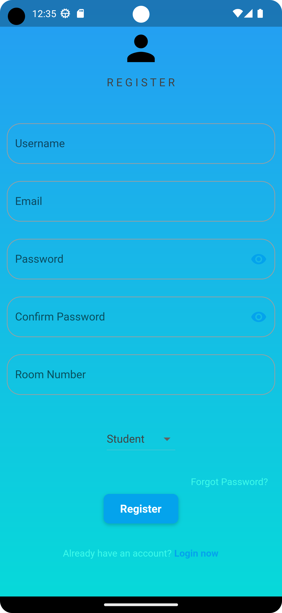
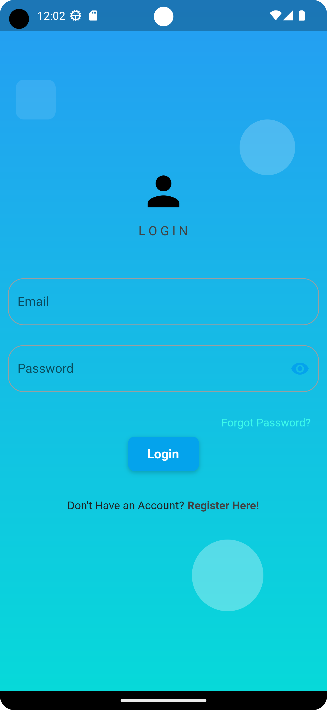
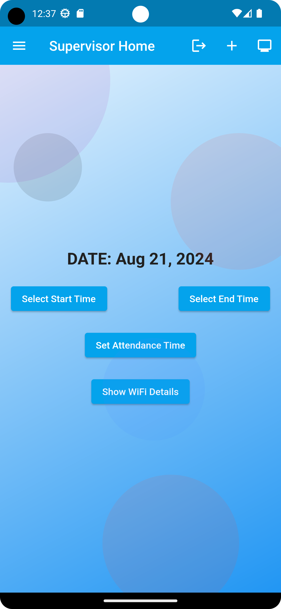
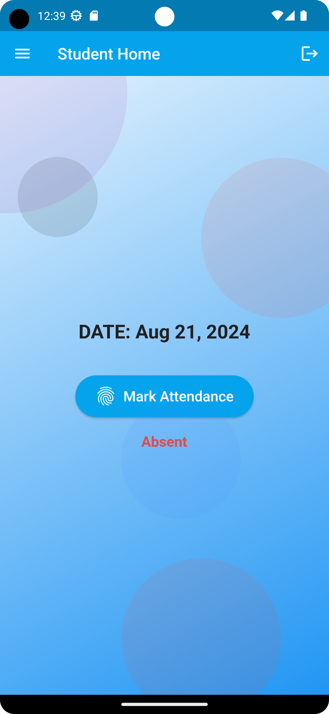
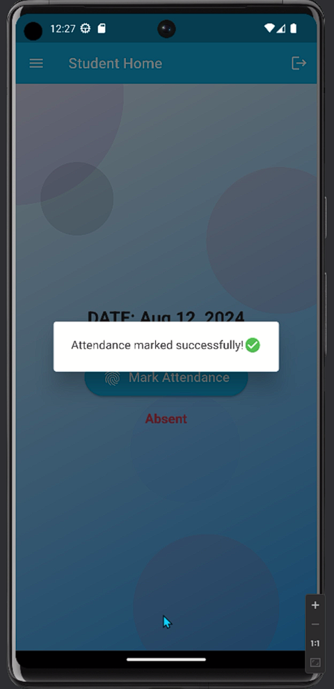
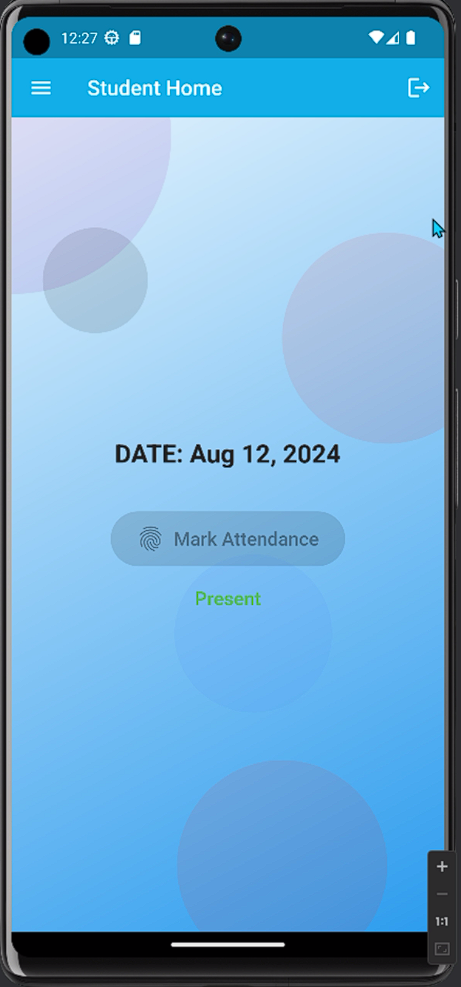
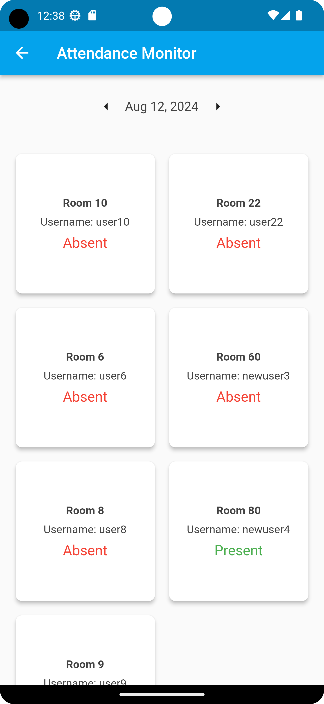

# Hostel Biometric Attendance App Using Facial Recognition

### Overview

The **Hostel Biometric Attendance App** is a mobile application built with Flutter that allows hostels to automate attendance marking using facial recognition technology. It ensures authenticity by preventing proxy attendance through a multi-layered validation system, including Wi-Fi verification, geolocation checks, and device ID validation. The app is designed to be scalable, secure, and user-friendly, making it practical for real-world deployment.

# Demo

https://github.com/vt24vikrant/HAP_Hostel-Attendance-App/blob/master/Screenshots/demo.mp4

### Features

-   **Facial Recognition for Attendance:** Uses pre-trained face detection and recognition models from Google ML Kit to identify and verify users.
-   **Wi-Fi Verification:** Ensures attendance is marked only when the device is connected to the authorized hostel Wi-Fi network.
-   **Geolocation Validation:** Verifies that the user is within the hostel premises when marking attendance.
-   **Device ID Validation:** Adds an extra layer of security by verifying the device's unique identifier (MAC address).
-   **Real-Time Data Processing:** Processes and updates attendance records in real time using Firebase services.

### System Architecture

The system architecture consists of the following components:

-   **Frontend:** Built with Flutter, the frontend provides a seamless interface for users to mark attendance.
-   **Backend:** Firebase handles authentication, real-time database storage, and hosting.
-   **Google ML Kit:** Powers the facial detection and recognition system.
-   **Firestore and Cloud Functions:** Manage and store attendance records, perform data rollups, and send notifications.

### Getting Started

#### Prerequisites

Before you begin, ensure you have met the following requirements:

-   Flutter SDK installed (installation guide).
-   A Firebase project set up (Firebase setup guide).
-   Basic knowledge of Dart and Flutter.

#### Installation

1.  **Clone the Repository:**
    
    
    `git clone https://github.com/yourusername/hostel-attendance-app.git
    cd hostel-attendance-app` 
    
2.  **Install Dependencies:**
    

    
    `flutter pub get` 
    
3.  **Configure Firebase:**
    
    -   Create a new Firebase project.
    -   Enable **Firebase Authentication**, **Firestore**, and **Cloud Functions** in your project.
    -   Download and replace the `google-services.json` and `GoogleService-Info.plist` files in their respective directories.
4.  **Run the App:**
    
    
    `flutter run` 
    

### Usage

1.  **User Registration:** Users must register via the app, during which facial embeddings are created and stored securely.
2.  **Marking Attendance:** Users can mark attendance by scanning their face, provided they are within the hostel’s authorized Wi-Fi network and geolocation area.
3.  **Admin Panel:** Admins can view attendance records, analyze data, and manage users via a separate admin dashboard (optional implementation).

### Technologies Used

-   **Flutter**: Cross-platform mobile development framework.
-   **Firebase**: Backend services including authentication, Firestore, Cloud Functions, and hosting.
-   **Google ML Kit**: Pre-trained face detection and recognition models.
-   **Dart**: Programming language for Flutter development.

### Security Features

-   **Facial Recognition:** Ensures that only authorized users can mark attendance.
-   **Wi-Fi Validation:** Prevents unauthorized marking of attendance outside the hostel premises.
-   **Geolocation Validation:** Adds an additional layer of security by checking the user's physical location.
-   **Device ID Validation:** Ensures that attendance can only be marked on registered devices.
### Screenshots

Here are some screenshots of the app in action:

#### Sign-Up Window

#### Login Window

#### Supervisor/Warden Landing Page

#### Attendance Marking

#### Attendance Monitor Panel

### Future Enhancements

-   **Optimize Facial Recognition:** Improve accuracy and reduce false rejections in challenging conditions (e.g., poor lighting).
-   **Enhanced Admin Panel:** Provide more robust data analysis tools for hostel administrators.
-   **Push Notifications:** Notify users when their attendance has been successfully marked or rejected.
-   **Offline Mode:** Allow attendance marking in offline mode with sync capabilities when connected.

### Contributing

Contributions are welcome! Please follow these steps:

1.  Fork the repository.
2.  Create your feature branch (`git checkout -b feature/AmazingFeature`).
3.  Commit your changes (`git commit -m 'Add some AmazingFeature'`).
4.  Push to the branch (`git push origin feature/AmazingFeature`).
5.  Open a pull request.quest.
